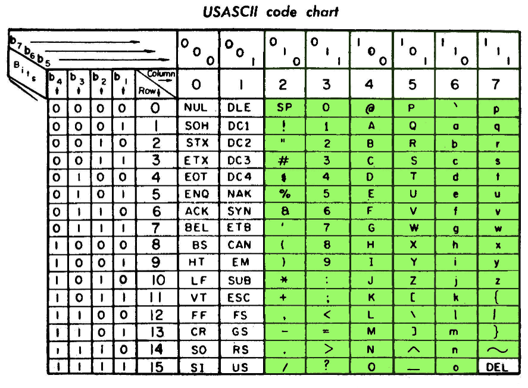

# printable-ascii

Output all the printable ASCII characters in various representations and formats.



# Install

Get `bin/printable-ascii` into your `$PATH` however you like.

If you'd like to use Homebrew while addition to Homebrew is pending you can install from this local formula.

```
brew install --formula ./Formula/printable-ascii.rb
```

# Docker

There's a [printable-ascii docker repo on Docker Hub](https://hub.docker.com/r/sdball/printable-ascii) and a [printable-ascii container page on GitHub](https://github.com/sdball/printable-ascii/pkgs/container/printable-ascii). Both are the exact same images (linux/amd66 and linux/arm64) so use whichever you like.

## via Docker Hub

```
$ docker run sdball/printable-ascii
$ docker run sdball/printable-ascii --json --decimal
```

## via GitHub Container Registry

```
$ docker run ghcr.io/sdball/printable-ascii:latest
$ docker run ghcr.io/sdball/printable-ascii:latest --json --decimal
```

# Usage

Running `printable-ascii` by itself will simply print all the printable ASCII characters in plaintext to your console.

```
$ printable-ascii | head

!
"
#
$
%
&
'
(
)
```

## Help text

Help is accessible with `-h` or `--help`

## Representations

You can add additional representations of the characters in the output.

- `--binary` or `-b` to include the base-2 ASCII numbers of the characters
- `--octal` or `-o` to include the base-8 ASCII numbers of the characters
- `--decimal` or `-d` to include base-10 ASCII numbers of the characters
- `--hex` or `-x` to include base-16 ASCII numbers of the characters

```
$ printable-ascii --decimal --hex --binary | head
CHARACTER   DECIMAL   HEXADECIMAL   BINARY
            32        20            100000
!           33        21            100001
"           34        22            100010
#           35        23            100011
$           36        24            100100
%           37        25            100101
&           38        26            100110
'           39        27            100111
(           40        28            101000
```

Fun fact, you can add as many duplicate representations as you want! The order of your declarations will be preserved.

```
$ printable-ascii -ooddxx --start-at 65 --end-at 71
CHARACTER   OCTAL   OCTAL   DECIMAL   DECIMAL   HEXADECIMAL   HEXADECIMAL
A           101     101     65        65        41            41
B           102     102     66        66        42            42
C           103     103     67        67        43            43
D           104     104     68        68        44            44
E           105     105     69        69        45            45
F           106     106     70        70        46            46
G           107     107     71        71        47            47
```

## Additional Representations

You can also add metadata about the ASCII characters to the output data.

- `--character-name` will include the official ASCII character names
- `--info-url` will include a generated link to codepoints.net with more info about each specific character

I checked almost a dozen "ASCII info" websites and codepoints.net was my favorite by a wide margin.

```
$ printable-ascii --character-name --info-url --range A-C
CHARACTER   NAME                     INFO_URL
A           LATIN CAPITAL LETTER A   https://codepoints.net/U+0041
B           LATIN CAPITAL LETTER B   https://codepoints.net/U+0042
C           LATIN CAPITAL LETTER C   https://codepoints.net/U+0043
```

## Header

In default usage the header row shows up when you add additional representations.

You can force the header to appear with `--header`

```
$ printable-ascii --header | head
CHARACTER

!
"
#
$
%
&
'
(
```

You can force the header to be omitted with `--no-header`.

```
$ printable-ascii --no-header -dxo | head
            32        20            40
!           33        21            41
"           34        22            42
#           35        23            43
$           36        24            44
%           37        25            45
&           38        26            46
'           39        27            47
(           40        28            50
)           41        29            51
```

The header declarations have no effect on the JSON output.

## JSON

JSON output is available with `--json`

```
$ printable-ascii --decimal --hex --binary --json | jq -c '.[]' | head
{"character":" ","decimal":"32","hexadecimal":"20","binary":"100000"}
{"character":"!","decimal":"33","hexadecimal":"21","binary":"100001"}
{"character":"\"","decimal":"34","hexadecimal":"22","binary":"100010"}
{"character":"#","decimal":"35","hexadecimal":"23","binary":"100011"}
{"character":"$","decimal":"36","hexadecimal":"24","binary":"100100"}
{"character":"%","decimal":"37","hexadecimal":"25","binary":"100101"}
{"character":"&","decimal":"38","hexadecimal":"26","binary":"100110"}
{"character":"'","decimal":"39","hexadecimal":"27","binary":"100111"}
{"character":"(","decimal":"40","hexadecimal":"28","binary":"101000"}
{"character":")","decimal":"41","hexadecimal":"29","binary":"101001"}
```

## Start and End

You can start/end the output at any ASCII integer within the printable range in base10 (32-126) or at any single ASCII character.

```
$ printable-ascii --start-at 65 --end-at 75
A
B
C
D
E
F
G
H
I
J
K
```

```
$ printable-ascii --start-at A --end-at K
A
B
C
D
E
F
G
H
I
J
K
```

To reliably use punctuation characters as start/end you must quote them due to shell behavior.

```
$ printable-ascii --start-at '"' --end-at "(" --decimal
CHARACTER   DECIMAL
"           34
#           35
$           36
%           37
&           38
'           39
(           40
```

```
$ printable-ascii --start-at " " --end-at "(" --decimal
CHARACTER   DECIMAL
            32
!           33
"           34
#           35
$           36
%           37
&           38
'           39
(           40
```

If you choose an end that's less than the start then you get no output.

```
$ printable-ascii --start-at 40 --end-at 35
```

## Random

The `--random NUMBER` option will output `NUMBER` of random printable ASCII characters.

If you combine this option with `--start-at` / `--end-at` then the random printable ASCII characters will be pulled from that range.

```
$ printable-ascii --random 8 --start-at 65 --end-at 90
P
Y
O
R
E
B
J
I
```

```
$ printable-ascii --random 1 --start-at 65 --end-at 66
A
```

```
$ printable-ascii --random 1 --start-at 65 --end-at 66
B
```

```
$ printable-ascii --start-at A --end-at F --json --random 10 | jq -c '.[]'
{"character":"F"}
{"character":"B"}
{"character":"B"}
{"character":"B"}
{"character":"E"}
{"character":"F"}
{"character":"E"}
{"character":"E"}
{"character":"A"}
{"character":"D"}
```

## Range

The `--range` command line option allows specifying a range of printable ASCII as "start-end"

```
$ printable-ascii --range A-F
A
B
C
D
E
F
```

The start/end of the range can be in base10 or ASCII characters or a mix.

```
$ printable-ascii --range A-70
A
B
C
D
E
F
```

Punctuation characters can be supplied for a range but must be quoted to ensure proper interpretation by both the script and your command line shell.

```
$ printable-ascii --range "#-("
#
$
%
&
'
(
```

The `--range` option supersedes the `--start-at` and `--end-at` options, although the start-at and end-at options are still valid.

```
$ printable-ascii --range A-E --start-at C
A
B
C
D
E
```

Multiple ranges can be provided

```
$ printable-ascii --range A-E --range v-z
A
B
C
D
E
v
w
x
y
z
```

Ranges can overlap and any overlapped characters will be listed twice

```
$ printable-ascii --range A-C --range A-F
A
B
C
A
B
C
D
E
F
```

Note: the output of `--range` declarations is NOT ASCII sorted. The ranges will appear in the order you define them.

## Named Ranges

## Named Ranges

Each of these options adds the specified characters as a `--range` option. They can be combined with each other and other `--range` declarations.

- `--punctuation`: all the punctuation characters
- `--alphabetic` / `--letters`: all the letter characters
- `--uppercase`: all the uppercase letters
- `--lowercase`: all the lowercase letters
- `--numeric` / `--digits`: all the numbers
- `--space`: THE space character (fun fact: tab is not in the set of printable ASCII)
- `--binary-digits`: the binary digits
- `--octal-digits`: the octal digits
- `--hex-digits`: the hex digits

The `--binary-digits` can be used a fun way to generate a lot of coin flips.

```
$ printable-ascii --binary-digits --random 10
0
1
0
1
1
1
1
1
0
0
```

Like a LOT of coin flips. Not _blazing_ speed but 3.5 seconds for a million isn't too bad! Hooray for lazy enumerators.

```
$ printable-ascii --binary-digits --random 1000000

0.76s user 0.41s system 32% cpu 3.540 total
```

# All the printable ASCII why not?

```
CHARACTER   BINARY   OCTAL   DECIMAL   HEXADECIMAL   NAME
            100000   40      32        20            SPACE
!           100001   41      33        21            EXCLAMATION MARK
"           100010   42      34        22            QUOTATION MARK
#           100011   43      35        23            NUMBER SIGN
$           100100   44      36        24            DOLLAR SIGN
%           100101   45      37        25            PERCENT SIGN
&           100110   46      38        26            AMPERSAND
'           100111   47      39        27            APOSTROPHE
(           101000   50      40        28            LEFT PARENTHESIS
)           101001   51      41        29            RIGHT PARENTHESIS
*           101010   52      42        2a            ASTERISK
+           101011   53      43        2b            PLUS SIGN
,           101100   54      44        2c            COMMA
-           101101   55      45        2d            HYPHEN-MINUS
.           101110   56      46        2e            FULL STOP
/           101111   57      47        2f            SOLIDUS
0           110000   60      48        30            DIGIT ZERO
1           110001   61      49        31            DIGIT ONE
2           110010   62      50        32            DIGIT TWO
3           110011   63      51        33            DIGIT THREE
4           110100   64      52        34            DIGIT FOUR
5           110101   65      53        35            DIGIT FIVE
6           110110   66      54        36            DIGIT SIX
7           110111   67      55        37            DIGIT SEVEN
8           111000   70      56        38            DIGIT EIGHT
9           111001   71      57        39            DIGIT NINE
:           111010   72      58        3a            COLON
;           111011   73      59        3b            SEMICOLON
<           111100   74      60        3c            LESS-THAN SIGN
=           111101   75      61        3d            EQUALS SIGN
>           111110   76      62        3e            GREATER-THAN SIGN
?           111111   77      63        3f            QUESTION MARK
@           1000000  100     64        40            COMMERCIAL AT
A           1000001  101     65        41            LATIN CAPITAL LETTER A
B           1000010  102     66        42            LATIN CAPITAL LETTER B
C           1000011  103     67        43            LATIN CAPITAL LETTER C
D           1000100  104     68        44            LATIN CAPITAL LETTER D
E           1000101  105     69        45            LATIN CAPITAL LETTER E
F           1000110  106     70        46            LATIN CAPITAL LETTER F
G           1000111  107     71        47            LATIN CAPITAL LETTER G
H           1001000  110     72        48            LATIN CAPITAL LETTER H
I           1001001  111     73        49            LATIN CAPITAL LETTER I
J           1001010  112     74        4a            LATIN CAPITAL LETTER J
K           1001011  113     75        4b            LATIN CAPITAL LETTER K
L           1001100  114     76        4c            LATIN CAPITAL LETTER L
M           1001101  115     77        4d            LATIN CAPITAL LETTER M
N           1001110  116     78        4e            LATIN CAPITAL LETTER N
O           1001111  117     79        4f            LATIN CAPITAL LETTER O
P           1010000  120     80        50            LATIN CAPITAL LETTER P
Q           1010001  121     81        51            LATIN CAPITAL LETTER Q
R           1010010  122     82        52            LATIN CAPITAL LETTER R
S           1010011  123     83        53            LATIN CAPITAL LETTER S
T           1010100  124     84        54            LATIN CAPITAL LETTER T
U           1010101  125     85        55            LATIN CAPITAL LETTER U
V           1010110  126     86        56            LATIN CAPITAL LETTER V
W           1010111  127     87        57            LATIN CAPITAL LETTER W
X           1011000  130     88        58            LATIN CAPITAL LETTER X
Y           1011001  131     89        59            LATIN CAPITAL LETTER Y
Z           1011010  132     90        5a            LATIN CAPITAL LETTER Z
[           1011011  133     91        5b            LEFT SQUARE BRACKET
\           1011100  134     92        5c            REVERSE SOLIDUS
]           1011101  135     93        5d            RIGHT SQUARE BRACKET
^           1011110  136     94        5e            CIRCUMFLEX ACCENT
_           1011111  137     95        5f            LOW LINE
`           1100000  140     96        60            GRAVE ACCENT
a           1100001  141     97        61            LATIN SMALL LETTER A
b           1100010  142     98        62            LATIN SMALL LETTER B
c           1100011  143     99        63            LATIN SMALL LETTER C
d           1100100  144     100       64            LATIN SMALL LETTER D
e           1100101  145     101       65            LATIN SMALL LETTER E
f           1100110  146     102       66            LATIN SMALL LETTER F
g           1100111  147     103       67            LATIN SMALL LETTER G
h           1101000  150     104       68            LATIN SMALL LETTER H
i           1101001  151     105       69            LATIN SMALL LETTER I
j           1101010  152     106       6a            LATIN SMALL LETTER J
k           1101011  153     107       6b            LATIN SMALL LETTER K
l           1101100  154     108       6c            LATIN SMALL LETTER L
m           1101101  155     109       6d            LATIN SMALL LETTER M
n           1101110  156     110       6e            LATIN SMALL LETTER N
o           1101111  157     111       6f            LATIN SMALL LETTER O
p           1110000  160     112       70            LATIN SMALL LETTER P
q           1110001  161     113       71            LATIN SMALL LETTER Q
r           1110010  162     114       72            LATIN SMALL LETTER R
s           1110011  163     115       73            LATIN SMALL LETTER S
t           1110100  164     116       74            LATIN SMALL LETTER T
u           1110101  165     117       75            LATIN SMALL LETTER U
v           1110110  166     118       76            LATIN SMALL LETTER V
w           1110111  167     119       77            LATIN SMALL LETTER W
x           1111000  170     120       78            LATIN SMALL LETTER X
y           1111001  171     121       79            LATIN SMALL LETTER Y
z           1111010  172     122       7a            LATIN SMALL LETTER Z
{           1111011  173     123       7b            LEFT CURLY BRACKET
|           1111100  174     124       7c            VERTICAL LINE
}           1111101  175     125       7d            RIGHT CURLY BRACKET
~           1111110  176     126       7e            TILDE
```

